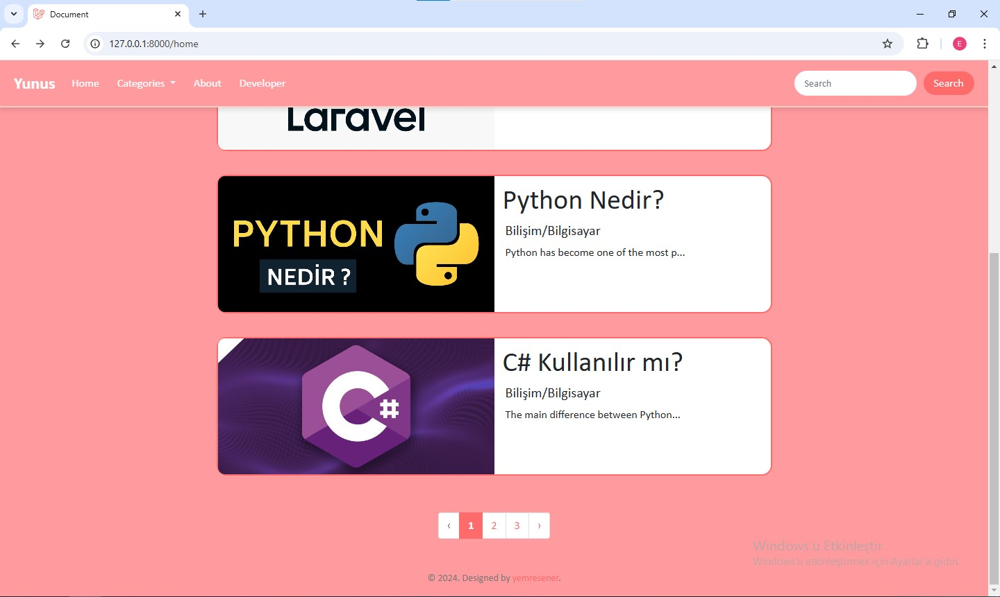
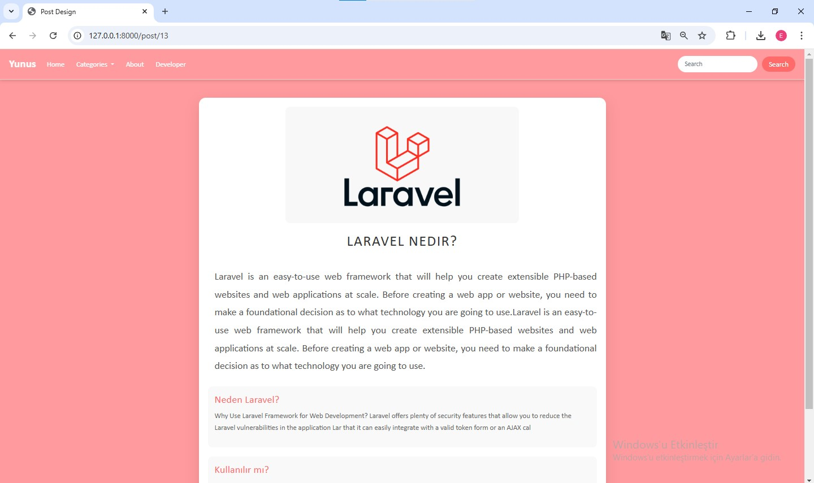
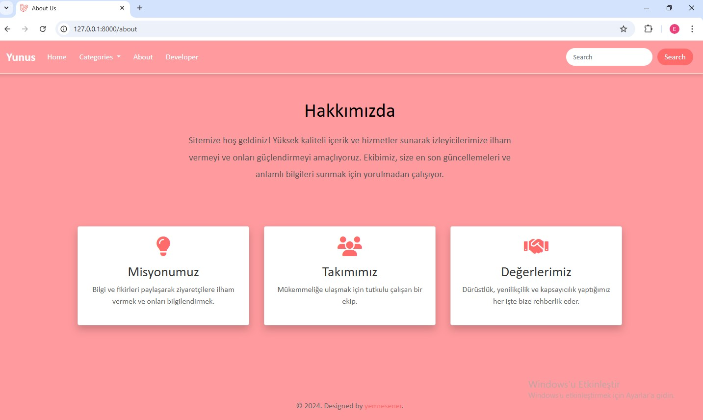
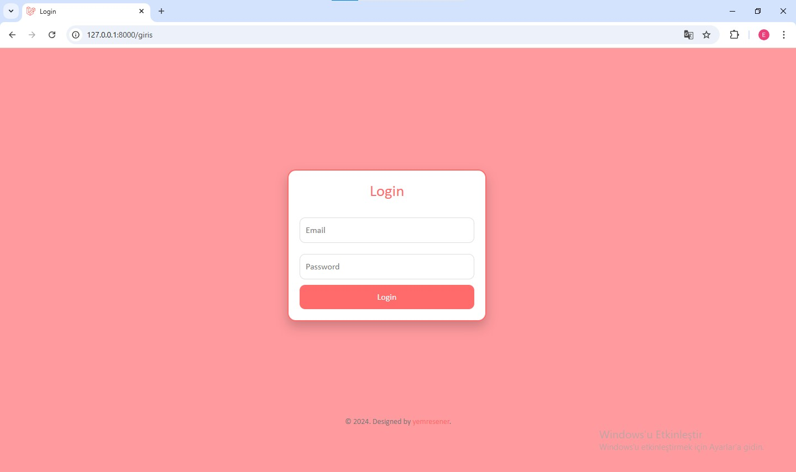
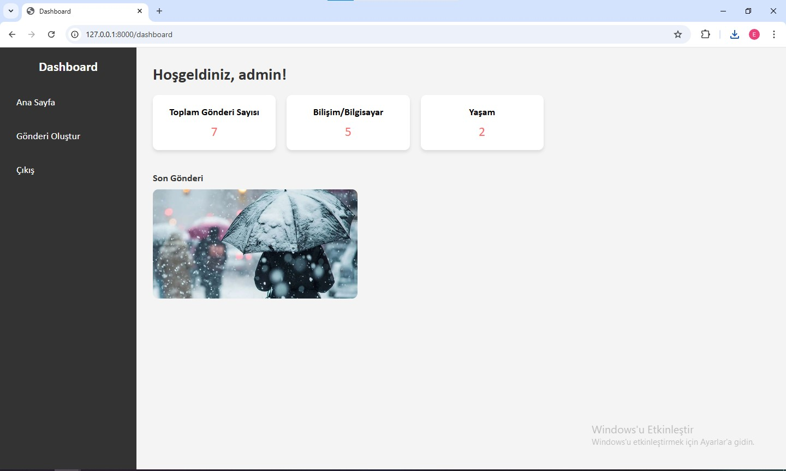
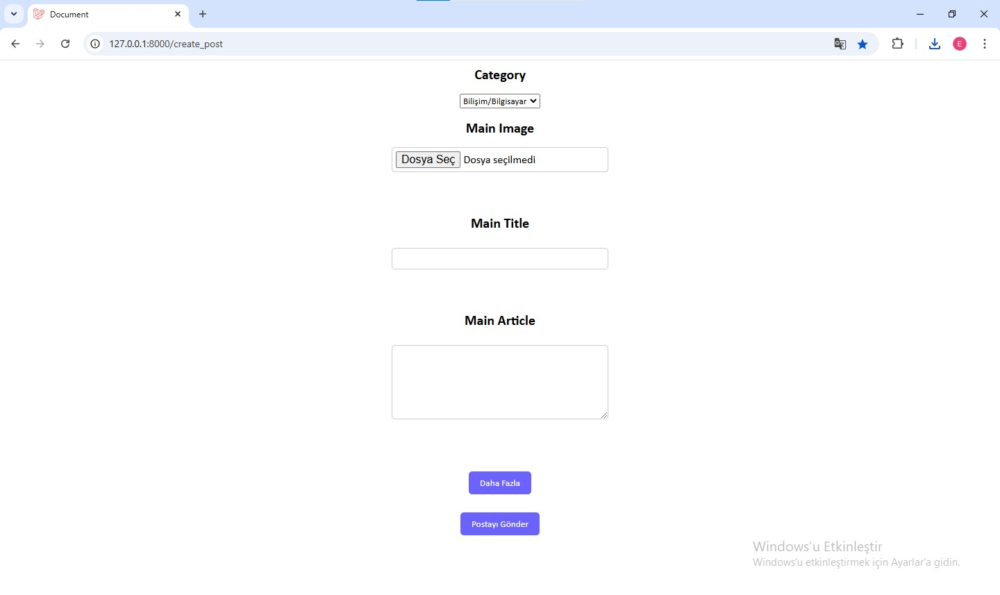
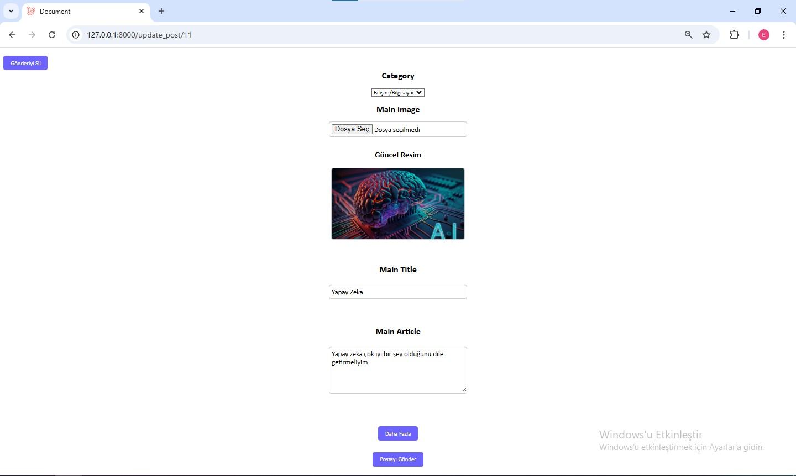
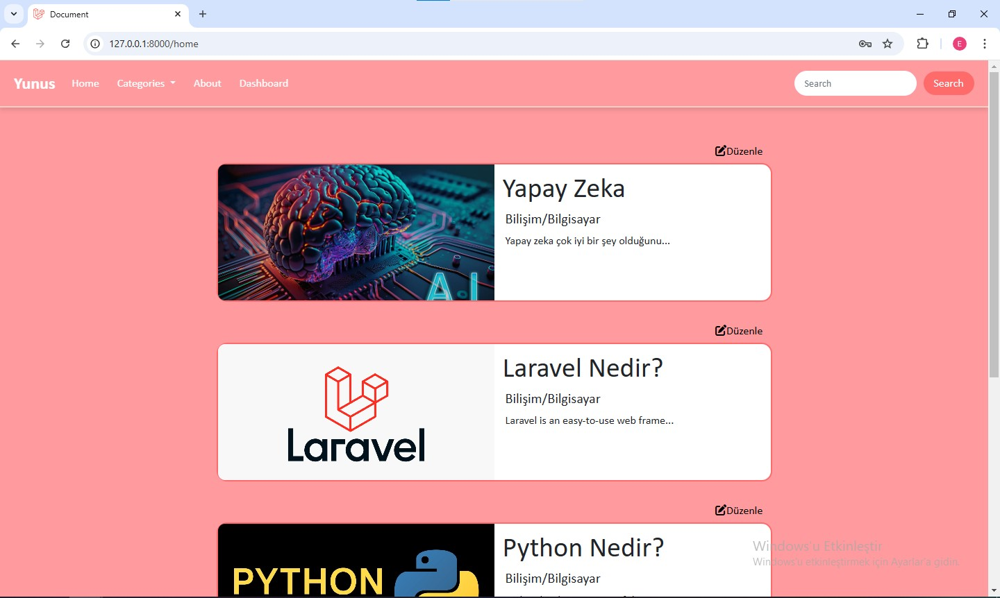
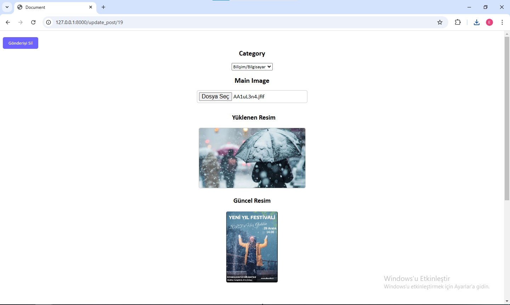

## Introduction

Laravel ile geliştirilmiş bir kişisel blog sayfası. Proje ana sayfa, gönderi sayfaları, hakkında ve developer bölümlerinden oluşmaktadır. Database olarak MySQL tercih edilmiştir. 

Genel kullanıcının erişebildiği sayfalar;

### Home Page

Bütün kullancılar tarafından erişilebilir, gönderilerden oluşan sayfa. Kullanıcının dilediği gönderiyi arama fonksiyonu, gönderileri sıralama fonksiyonları vardır.

### Post Page

Kullanıcı dostu bir gönderi sayfası düzenlenmiştir.

### About Page

Sayfa ve yöneticiler hakkında sunulan bilgilerin bulunduğu sayfa.

## Admin Pages

### Developer Login Page

Giriş için gerekli boşlukların istenilen şekilde doldurulduktan sonra gerekli authentication işlemleri yapılmaktadır.

### Dashboard

Yetkili kişinin gönderi oluşturabildiği, gönderi istatistiklerini görebildiği ve tabi ki çıkış yapabildiği sayfadır.

### Create Post

İhtiyaç duyulan alanlar doldurultuktan sonra gönderi eklenilen bölüm.

### Update Post

Gönderi de güncelleme yapmak için giriş yapıldıktan sonra home page de ekrana gelen düzenle butonları kullanılmaktadır;

Güncelleme sırasında resim değiştirme esnasında güncel ve eski resim gösterilerek kullanıcı dostu olmaya bir adım daha atılmıştır.

## In the Feature
1. **Kullanıcı (Admin Olmayan) Girişi**
   - Kullanıcıların kendi hesaplarını oluşturabilmesi.
   - Güvenli giriş yapabilmesi.

2. **Gönderilere Kullanıcı Yorumları Eklenmesi**
   - Kullanıcıların gönderiler altına yorum bırakabilmesi.
   - Admin onayı gerektiren bir yorum sistemi opsiyonu.
   - Nested comments (yorumlara yanıt verme) desteği.

3. **Kullanıcıların Kendi Blog Yazılarını Oluşturabilmesi**
   - Kullanıcılar için gönderi oluşturma ve düzenleme alanı.
   - Kullanıcı gönderilerinin admin onayından geçmesi.
   - Kullanıcı profil sayfasında, kendi yazılarını görüntüleme ve yönetme fonksiyonları.

---

